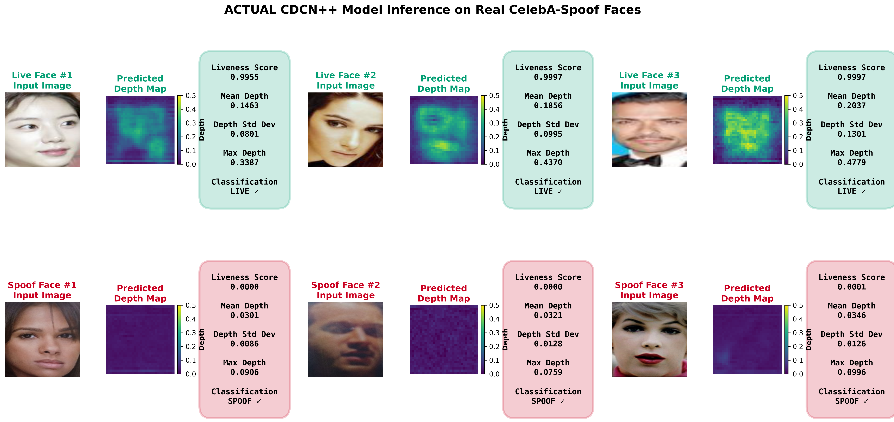
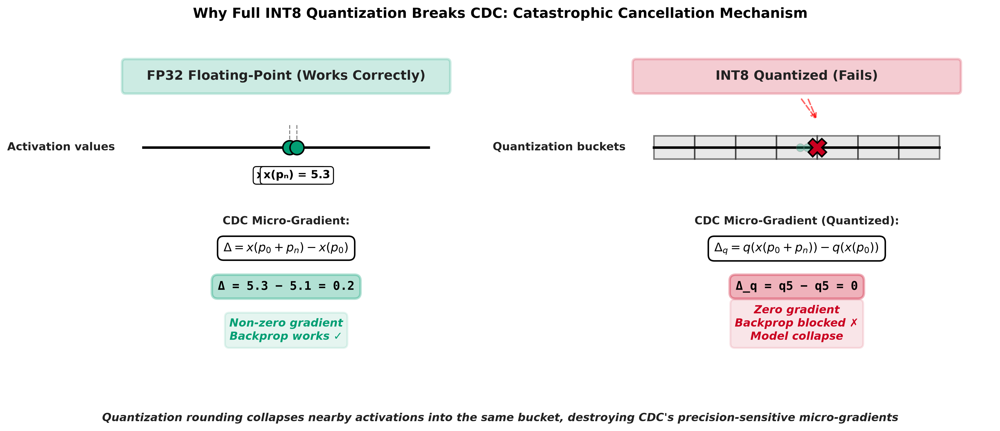
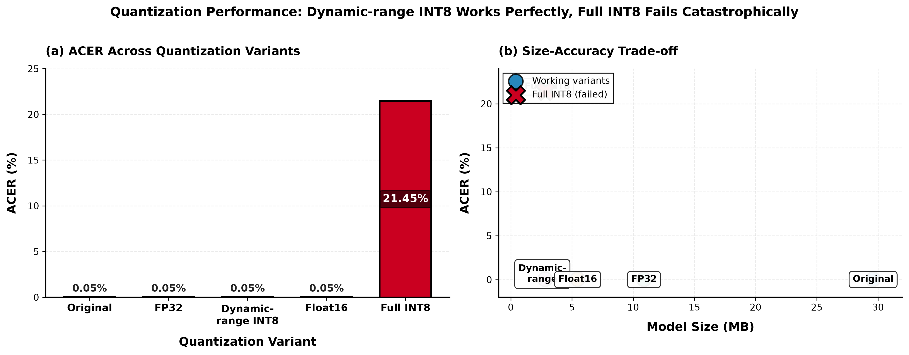
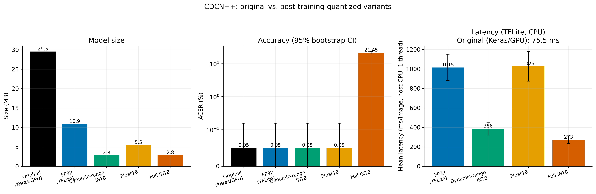
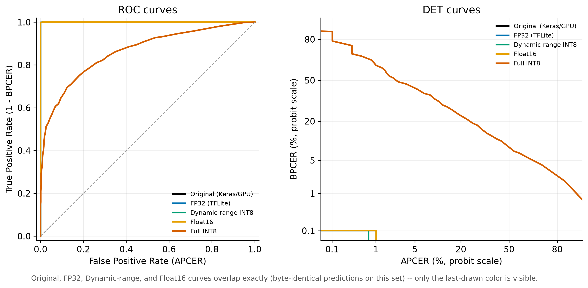
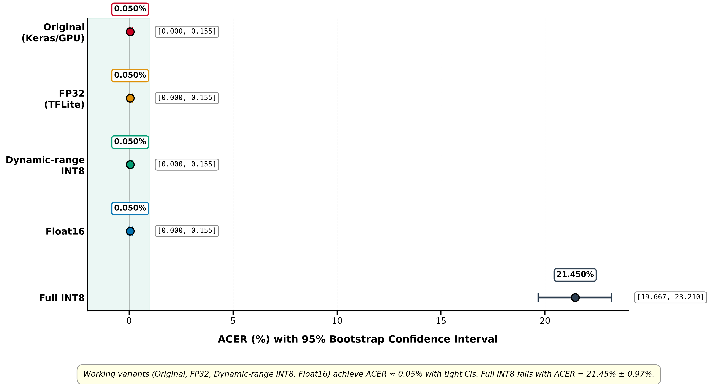
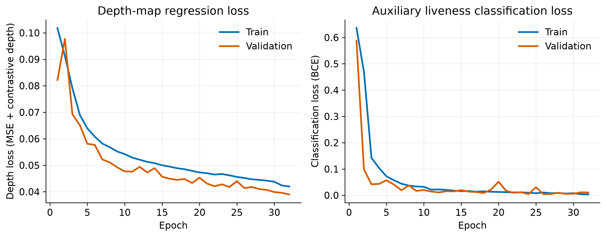

<div align="center">

# Post-Training Quantization of CDCN++<br/>for Face Anti-Spoofing on the Edge

**Anubhav Sinha · Dr. Sishaj p Simon**
National Institute of Technology, Tiruchirappalli


</div>

---

Research code for the paper **"Post Training Quantization of Central Difference
Convolution Network for Facial Anti-Spoofing on Edge."**

The project implements the CDCN / CDCN++ face anti-spoofing architecture from
Yu et al., *"Searching Central Difference Convolutional Networks for Face
Anti-Spoofing"* (CVPR 2020, [arXiv:2003.04092](https://arxiv.org/abs/2003.04092)),
trains it with depth supervision on CelebA-Spoof, compresses it four different
ways with TensorFlow Lite post-training quantization (PTQ), and measures what
each compression method costs in presentation-attack-detection accuracy.

<div align="center">

<br/>
<em>The 2.80 MB dynamic-range INT8 model running on real CelebA-Spoof faces.<br/>
Live faces yield structured depth and liveness ≈ 1.0; 2D spoofs yield flat depth and ≈ 0.</em>
</div>

---

## The finding

> **Dynamic-range INT8 gives a 10.6× smaller model and 2.6× faster CPU inference at
> zero accuracy loss. Full-integer INT8 destroys the model** — ACER 0.05% → 21.45%,
> a 429× degradation.

The collapse is not gradual, it is binary. The proposed mechanism is **catastrophic
cancellation** inside the Central Difference Convolution: CDC subtracts two
nearly-equal quantities, and int8 activation quantization rounds both into the same
bucket, zeroing out exactly the micro-gradient signal the operator exists to capture.

<div align="center">

<br/>
<em>Why full INT8 breaks CDC. Weight-only quantization leaves activations in float,
so the subtraction stays exact — which is why three of four variants survive.</em>
</div>

---

## Results

Evaluated on a balanced 1,983-image held-out split of CelebA-Spoof
(988 live / 995 spoof), threshold calibrated per run to minimise ACER.
Source: [cdcn_quantized/full_comparison_metrics.md](cdcn_quantized/full_comparison_metrics.md).

| Variant | Params (M) | MACs (G) | Size (MB) | ACER (%) [95% CI] | EER (%) | ROC-AUC | Latency (ms) |
|---|---|---|---|---|---|---|---|
| Original (Keras, GPU) | 2.56 | 52.46 | 29.55 | 0.050 [0.000, 0.155] | 0.050 | 1.0000 | 75.5 (GPU) |
| FP32 (TFLite) | 2.56 | 52.46 | 10.88 | 0.050 [0.000, 0.155] | 0.050 | 1.0000 | 1015.5 (CPU) |
| **✅ Dynamic-range INT8** | 2.56 | 52.46 | **2.80** | **0.050 [0.000, 0.155]** | 0.050 | 1.0000 | **386.1 (CPU)** |
| Float16 | 2.56 | 52.46 | 5.46 | 0.050 [0.000, 0.155] | 0.050 | 1.0000 | 1026.4 (CPU) |
| **❌ Full INT8** | 2.56 | 52.46 | 2.84 | **21.450 [19.667, 23.210]** | 22.039 | 0.8629 | 272.6 (CPU) |

<div align="center">

</div>

<div align="center">

<br/>
<em>Size, accuracy and latency together. Dynamic-range INT8 is the only variant
that is simultaneously small, fast and accurate.</em>
</div>

Operating points for the full-INT8 failure case: BPCER@APCER=1% is **62.0%**
(vs. 0.1% for every other variant), APCER 12.35%, BPCER 30.55%. At a realistic
security setting, the int8 model rejects nearly two thirds of genuine users.

<div align="center">

<br/>
<em>ROC and DET. The Original, FP32, dynamic-range and Float16 curves overlap
<strong>exactly</strong> — their predictions are byte-identical, so only the
last-drawn colour is visible.</em>
</div>

### Statistical significance

**McNemar's test**, original vs. each variant on the same samples:

| Comparison | Discordant (b, c) | p-value | Significant |
|---|---|---|---|
| Original vs. FP32 | (0, 0) | 1 | no |
| Original vs. Dynamic-range INT8 | (0, 0) | 1 | no |
| Original vs. Float16 | (0, 0) | 1 | no |
| Original vs. Full INT8 | (425, 0) | ~0 | **YES** |

Zero discordant pairs for the first three means those variants make *identical*
per-image decisions to the unquantized model — the compression is
decision-equivalent, not merely similar. Full INT8 flips 425 decisions, always
in the wrong direction.

<div align="center">

<br/>
<em>ACER with 95% bootstrap confidence intervals. The failure is far outside
the noise band of the working variants.</em>
</div>

### Two caveats, stated up front

- **ROC-AUC of 1.0000 and ACER of 0.05% are suspiciously perfect.** Train and
  validation splits both come from the single `test` split of
  `nguyenkhoa/celeba-spoof-for-face-antispoofing-test`, split 80/20 by
  `train_test_split(seed=42)`. There is no subject-disjoint guarantee: the same
  identity (and plausibly near-duplicate captures of the same spoof medium) can
  appear on both sides. These numbers characterise *quantization deltas*
  reliably — every variant sees the same split — but should not be read as
  cross-dataset generalisation.
- **CPU latency numbers are host-machine measurements**, single-threaded TFLite
  on a desktop CPU, not on a Raspberry Pi or phone. They are internally
  comparable, not an edge-device benchmark. Note that FP32/Float16 TFLite on CPU
  is *slower* than the Keras GPU model by ~13×; the meaningful comparison is
  TFLite-vs-TFLite.

---

## Repository layout

```
.
├── CDCN_internship_project.ipynb   # ← the main artifact: model, training, eval, quantization
├── cdcn_internship.ipynb           # scratch notebook (CUDA path fix only)
├── cdcn_pytorch.py                 # standalone PyTorch reference implementation
├── model.py                        # Keras layer/model definitions extracted from the notebook
├── models.py                       # empty placeholder
│
├── cdcn_quantized/                 # quantization outputs + metrics
│   ├── cdcnpp_fp32.tflite
│   ├── cdcnpp_dynamic_range.tflite # ← the recommended deployment artifact
│   ├── cdcnpp_float16.tflite
│   ├── cdcnpp_full_int8.tflite     # kept as the documented failure case
│   ├── quantization_comparison.{csv,md}
│   ├── full_comparison_{metrics.csv,metrics.md,results.json}
│   ├── mcnemar_results.csv
│   └── fig_*.{png,pdf}
│
├── paper_figures/                  # publication figure set (PNG + PDF)
│   ├── INDEX.md                    # per-figure purpose, key finding, target section
│   ├── FIGURE_GUIDE.md             # long-form figure captions / interpretation notes
│   └── COMPLETE_SUMMARY.txt
│
├── cdcn_figures/                   # training-run figures (loss, ROC, confusion matrix)
│
├── generate_*.py                   # figure generation scripts (see Figures)
├── real_inference_*.py             # run the quantized model on real CelebA-Spoof faces
├── verify_cuda.py, test_cuda_simple.py   # GPU environment checks
│
├── requirementssetup               # dependency list (see Environment)
└── .vscode/                        # CUDA env vars, run tasks, debug configs, CUDA_SETUP.md
```

**Not included in this repository** (see [.gitignore](.gitignore)): the paper
drafts, which are an unpublished co-authored manuscript; the third-party source
PDFs, which are cited by URL under [References](#references) instead; the trained
Keras checkpoint `cdcnpp_best.weights.h5` — the `.tflite` files in
`cdcn_quantized/` are the released model artifacts.

---

## The model

### Central Difference Convolution (CDC)

The core operator, from Eq. 4 of the CDCN paper:

```
y(p₀) = Σ w(pₙ)·x(p₀+pₙ)  −  θ · x(p₀) · Σ w(pₙ)
         └── vanilla conv ──┘   └─ central difference ─┘
```

Implemented as a vanilla `Conv2D` minus a 1×1 convolution whose kernel is the
spatial sum of the vanilla kernel — mathematically equivalent, and it reuses one
weight tensor instead of two. `θ = 0.7` throughout (the paper's value).

Two invariants are asserted in the notebook:

- `θ = 0` must reduce exactly to the vanilla convolution.
- `θ = 1` on a constant input must produce ~0 in the interior (the two terms
  cancel), with non-zero values only at the padded border.

The PyTorch reference in [cdcn_pytorch.py](cdcn_pytorch.py) notes and fixes a typo
in the paper's own Fig. 9 snippet (`self.conv.weight` should be `self.vani.weight`).

### Architectures

Both take `(B, 256, 256, 3)` RGB and emit a `(B, 32, 32, 1)` facial depth map.

| | CDCN (Table 1 baseline) | CDCN++ (Fig. 5, NAS-discovered) |
|---|---|---|
| Stem | CDC → 64 | CDC → 64 → 128 |
| Levels | three blocks, 128→196→128 each | NAS cells; `CDC_2_r` with r = 1.6 / 1.2 / 1.4 at mid |
| Fusion | plain concat at 32×32 | **MAFM** attention fusion |
| Head | 3-layer CDC | 2-layer CDC |
| Size | — | **2.56M params, 52.46 GMACs** |

CDCN++ is the model that is trained and quantized. Only the *discovered*
architecture is implemented — the PC-DARTS NAS search procedure is not reproduced.

### MAFM (Multiscale Attention Fusion Module)

Spatial attention (`[avg-pool, max-pool] → conv → sigmoid`) applied separately to
the low/mid/high feature maps with kernel sizes **7 / 5 / 3**, then pooled to
32×32 and concatenated. The attention convolutions are deliberately **vanilla,
not CDC** — the paper's Table 3 ablation shows CDC hurts here, because spatial
attention needs global semantic context rather than local gradients.

### Auxiliary classification head (a deviation from the paper)

`CDCNpp` returns a dict `{'depth': (B,32,32,1), 'cls': (B,1)}`. The `cls` branch
is a `GlobalAveragePooling2D → Dense(1, sigmoid)` on the fused features.

This was added to fix a real failure: with depth supervision alone, liveness had
to be read out as "mean of the predicted depth map", which gives no direct
classification gradient, and the model collapsed to a constant input-independent
output. The auxiliary head supplies that gradient, and its sigmoid output — not
the depth mean — is the liveness score used in all reported metrics.

### Loss

```
L_total = L_depth + L_cls
L_depth = MSE(depth_true, depth_pred) + CDL(depth_true, depth_pred)
L_cls   = binary cross-entropy
```

`CDL` (contrastive depth loss) compares image gradients of the true and predicted
depth maps, so the network is penalised for getting the *shape* of the depth
surface wrong and not just its absolute values. Depth and classification losses
are equally weighted (1.0 / 1.0).

> **Note:** the notebook's final `contrastive_depth_loss` uses **L1** on the
> gradient difference; the earlier draft cell (and the PyTorch-side notes) use
> **L2**. The L1 version is the one used in training.

---

## Data pipeline

**Dataset:** [`nguyenkhoa/celeba-spoof-for-face-antispoofing-test`](https://huggingface.co/datasets/nguyenkhoa/celeba-spoof-for-face-antispoofing-test)
(Hugging Face). It ships a single `test` split, divided 80/20 into
`ds_train_pool` / `ds_val`.

> ⚠️ **Label convention is inverted.** In the raw HF rows, `labels == 0` means
> **live** and `labels == 1` means **spoof**. The project's internal convention is
> the opposite (`1 = live`). All conversion goes through the single `get_label()`
> helper — check it before writing any new evaluation code, because getting this
> backwards silently inverts every metric.

**Class balancing:** CelebA-Spoof is ~70% spoof, so training draws up to
10,000 live + 10,000 spoof (auto-capped by whichever class runs out first, i.e.
live). A separate 300+300 *monitor* split, taken from the unused tail of the same
shuffled permutation, feeds `validation_data` during training — guaranteeing it
is disjoint from both the training slice and `ds_val`.

### Geometry-based depth targets

The depth-map ground truth is the part most likely to trip up a reader, so:

- **Spoof** → an all-zero 32×32 depth map (a print or screen has no 3D face).
- **Live** → a per-image depth target derived from **actual detected face
  geometry**: OpenCV Haar cascade for detection + the LBF facemark model for 68
  iBUG landmarks, combined with a fixed anatomical "protrusion toward camera"
  prior per landmark index (nose tip highest, jaw line lowest, etc.). Cached per
  dataset index on first access.

This replaced an earlier target that redrew a **random Gaussian blob on every
`__getitem__` call** — a different ground truth for the same image every epoch.
With no stable input→output mapping to learn, the network's optimal strategy was
to emit the average target and ignore the input entirely; this was the direct
cause of the "predicts live for everything" collapse in earlier runs. Determinism
of the target is the fix.

MediaPipe FaceLandmarker was the first choice (true 3D per-vertex depth) but was
abandoned: it segfaults natively in this WSL environment (GL/EGL context) and its
legacy `solutions` API conflicts with the protobuf version this TensorFlow install
requires.

Haar cascade and LBF model files are downloaded on first run into `~/cdcn_assets/`
(`cv2.data.haarcascades` is empty in this environment's `opencv-contrib-python`
install, so they are fetched from the OpenCV / GSOC2017 repos directly).

### Augmentation

Training generator only (`augment=True`); evaluation and monitoring generators
run clean. Horizontal flip + ±10° rotation + brightness/contrast jitter
(gain 0.85–1.15, bias ±0.15). **The flip is mirrored onto the depth target** —
otherwise a flipped face would be regressed against a now-wrong-sided depth map.

---

## Training

| Setting | Value | Why |
|---|---|---|
| Optimizer | AdamW, lr `1e-4`, weight decay `5e-5` | matches the CDCN paper's recipe |
| Batch size | 8 | 16 OOM'd — this GPU exposes ~5 GB to TF and a bs=16 backward pass tried to allocate 6+ GB |
| Epochs | 40 (upper bound) | EarlyStopping usually stops sooner |
| Callbacks | EarlyStopping(val_loss, patience 6, restore best), ReduceLROnPlateau(×0.5, patience 4), ModelCheckpoint | |
| Checkpoint | `cdcnpp_best.weights.h5` | not committed — see [Known gaps](#known-gaps-and-caveats) |
| BatchNorm | momentum 0.9, ε 1e-5, He-normal init | |

<div align="center">

<br/>
<em>Both objectives converge over 32 epochs. The auxiliary BCE drops to near zero
within ~10 epochs; the depth loss keeps improving slowly, and validation tracks
train without divergence.</em>
</div>

---

## Evaluation protocol

Metrics follow **ISO/IEC 30107-3** presentation-attack-detection terminology:

| Metric | Meaning |
|---|---|
| **APCER** | fraction of *spoof* samples wrongly accepted as live — the security risk |
| **BPCER** | fraction of *live* samples wrongly rejected — the usability cost |
| **ACER** | the mean of the two |
| **EER** | equal error rate |
| **BPCER@APCER=k%** | usability cost at a fixed security operating point — the metric that actually matters for deployment, and where full INT8 looks worst |

The decision threshold is **not** hardcoded: each evaluation run sweeps the ROC
curve and picks the point minimising ACER. 95% confidence intervals on ACER and
AUC are bootstrapped. Evaluation runs on a class-balanced subset of `ds_val`
(shuffled first — an earlier run's `select(range(2000))` grabbed a spoof-only
slice because the rows were ordered).

Inference batch size is 8, not 16: a bs=16 forward pass OOM'd after a long
training run because the GPU memory pool was fragmented by then.

---

## Quantization

Post-training quantization only. **QAT was considered and rejected**: `CDCNpp` is
a subclassed Keras model with a custom `CDC` layer, and `tfmot` targets
Functional/Sequential models with registered layer types, so QAT would require
rewriting the model *and* authoring a custom quantization config for `CDC`. PTQ
operates on the frozen inference graph regardless of how the model was built.

Four variants, all converted from the same SavedModel:

| Variant | What is quantized | Calibration | Verdict |
|---|---|---|---|
| FP32 | nothing (fair CPU baseline) | — | ✅ baseline |
| Dynamic-range | int8 weights, float activations | none needed | ✅ **recommended** |
| Float16 | fp16 weights | none needed | ✅ works |
| Full INT8 | int8 weights **and** activations | 200 images from the **training pool only** | ❌ collapses |

The calibration set is drawn strictly from `ds_train_pool`, never from the
held-out `ds_val` used for reporting.

> **Export gotcha worth remembering:** exporting via plain `tf.saved_model.save()`
> on this subclassed model left a BatchNorm variable as an unresolved
> `READ_VARIABLE` op, which made full-int8 conversion fail outright. Keras 3's
> `Model.export()` — purpose-built for a fully-frozen inference-only SavedModel —
> resolves it. That is what the notebook uses.

**The practical takeaway for edge deployment: use dynamic-range INT8.** It is the
smallest variant that preserves accuracy exactly (2.80 MB, 10.6× smaller than the
Keras checkpoint), and the fastest of the accuracy-preserving options.

---

## Figures

[paper_figures/INDEX.md](paper_figures/INDEX.md) and
[paper_figures/FIGURE_GUIDE.md](paper_figures/FIGURE_GUIDE.md) document each
figure's purpose, key finding, and intended paper section. Every figure exists as
both PNG (presentations) and PDF (submission). Colour palette is Okabe-Ito /
colorblind-safe throughout.

### Measured on real data

| Figure | File | Generated by |
|---|---|---|
| Inference on real faces | [`ACTUAL_inference_CLEAN.png`](paper_figures/ACTUAL_inference_CLEAN.png) | `real_inference_clean.py` |
| Quantization collapse | [`Fig1_quantization_collapse_PUBLICATION.png`](paper_figures/Fig1_quantization_collapse_PUBLICATION.png) | `generate_publication_figures.py` |
| Size / accuracy / latency | [`fig_full_comparison_bars.png`](cdcn_quantized/fig_full_comparison_bars.png) | notebook |
| ROC + DET curves | [`fig_roc_det_combined.png`](cdcn_quantized/fig_roc_det_combined.png) | notebook |
| ACER forest plot | [`FigX_forest_plot_PUBLICATION.png`](paper_figures/FigX_forest_plot_PUBLICATION.png) | `generate_forest_plot.py` |
| Training curves | [`fig_loss_components.png`](cdcn_figures/fig_loss_components.png) | notebook |
| Confusion matrix, ROC | [`cdcn_figures/`](cdcn_figures/) | notebook |

### Conceptual diagram

| Figure | File | Note |
|---|---|---|
| Catastrophic cancellation | [`Fig3_mechanism_PUBLICATION.png`](paper_figures/Fig3_mechanism_PUBLICATION.png) | An explanatory schematic of the INT8 failure mode, not a measurement. |

### ⚠️ Illustrative only — synthetic data

These were generated with simulated inputs and **must not be presented as
experimental results**:

| Figure | What is synthetic |
|---|---|
| [`fig2_depth_visualization.png`](paper_figures/fig2_depth_visualization.png) | Entirely synthetic. Inputs are random noise, and the "predicted" depth is literally `ground_truth + 0.02 × randn`. |
| [`fig_depth_statistics.png`](paper_figures/fig_depth_statistics.png) | Distributions are simulated from assumed parameters, not measured. |
| [`fig0_real_depth_maps.png`](paper_figures/fig0_real_depth_maps.png) | Faces are real CelebA-Spoof; the paired depth maps are synthetic Gaussians. Regenerate with `generate_depth_maps.py` before use. |

Likewise, `generate_dataset_samples_cached.py`, `generate_depth_maps_simplified.py`
and `real_inference_fast.py` fall back to synthetic imagery when the dataset or
landmark stack is unavailable. For anything going into the paper, use
`generate_dataset_samples.py`, `generate_depth_maps.py`, and
`real_inference_{quantized,clean,large}.py`.

---

## Environment

### Dependencies

From [requirementssetup](requirementssetup):

```
tensorflow>=2.21.0
keras>=3.15.0
opencv-contrib-python
datasets
scikit-learn
matplotlib
numpy
tqdm
```

Plus `scipy` (used by `generate_depth_maps_simplified.py`) and, for the PyTorch
reference implementation only, `torch`.

> Install `scikit-learn`, not `sklearn` — the latter is a deprecated PyPI
> meta-package and its install fails.

### GPU / CUDA

The first cell of the notebook prepends the pip-installed CUDA `ptxas` to `PATH`
**before** `import tensorflow`, and this is load-bearing, not cosmetic:

- The dev machine's RTX 5070 (Blackwell, compute capability 12.0a) needs a `ptxas`
  newer than 12.6.3 to JIT-compile all kernels. Without it, `model.fit()` fails
  outright on backward-conv kernels ("Autotuner could not compile any configs").
- The system CUDA 13 toolkit's `ptxas` is ABI-incompatible with the pip-installed
  CUDA 12.9 runtime libs (`nvidia-cudnn-cu12`, `nvidia-cublas-cu12`) and segfaults.
- The fix is to use the `ptxas` bundled with `nvidia-cuda-nvcc-cu12` (CUDA 12.9),
  matching the runtime libs. It must run before the first GPU op.

Verify the stack with:

```powershell
python verify_cuda.py       # env vars, driver, TF device list, cuDNN
python test_cuda_simple.py  # actual GPU matmul + timing
```

[.vscode/CUDA_SETUP.md](.vscode/CUDA_SETUP.md) documents the VS Code tasks
(`Ctrl+Shift+B`), debug configs, and GPU-monitoring commands.

---

## Reproducing

Order matters — the notebook cells are stateful and several later cells depend on
names defined earlier (`get_label`, `geometry_depth_map`, `_HAAR_PATH`,
`ds_train_pool`, `ds_val`, `model`, `history`).

1. **Verify the GPU stack** — `python verify_cuda.py`.
2. **Open [`CDCN_internship_project.ipynb`](CDCN_internship_project.ipynb)** and run cells top to bottom:
   - cells 1–2: CUDA `PATH` fix, then TF import (do not reorder);
   - cells 3–12: CDC operator + invariant tests + CDCN / CDCN++ definitions;
   - cells 13–17: losses, dataset load, geometry depth targets, generator, training;
   - cells 20–23: validation metrics (APCER/BPCER/ACER, ROC) and loss curves;
   - cells 24–27: TFLite export, four-variant PTQ, comparison table + figure.
3. **Generate the paper figures** — run the `generate_*.py` scripts (they read
   `cdcn_quantized/full_comparison_results.json`, so run the quantization cells
   first) and the `real_inference_*.py` scripts for qualitative panels.

### Inference only

Skip straight to [`cdcn_quantized/cdcnpp_dynamic_range.tflite`](cdcn_quantized/cdcnpp_dynamic_range.tflite).
[real_inference_clean.py](real_inference_clean.py) shows a complete
load-interpret-score loop, including `find_output_index()`, which distinguishes
the `cls` output (1 element) from the `depth` output (32×32) **by element count
rather than by name or index**, since TFLite does not preserve output ordering.

---

## Known gaps and caveats

- **`cdcnpp_best.weights.h5` is not in this repository.** The quantization cells
  load it, so they cannot be re-run from scratch without retraining. The `.tflite`
  files in `cdcn_quantized/` are the surviving trained artifacts.
- **`models.py` is empty**; [model.py](model.py) holds the Keras definitions but is
  a fragment lifted from the notebook — it has no imports and no `THETA` /
  `BN_MOMENTUM` / `CONV_INIT` definitions, so it will not import standalone.
  [cdcn_pytorch.py](cdcn_pytorch.py) *is* self-contained and runnable
  (`python cdcn_pytorch.py` runs a shape + parameter-count smoke test).
- **`.vscode/settings.json` sets `TF_CUDA_COMPUTE_CAPABILITY=89`** (Ada), which
  does not match the RTX 5070 (12.0a) described in the notebook's CUDA comment.
  It also points the interpreter at `cdcn_gpu_env/Scripts/python.exe`, a
  virtualenv that is not part of this repository.
- **Two notebooks exist.** `CDCN_internship_project.ipynb` is the real one;
  `cdcn_internship.ipynb` contains only the CUDA path-fix cell and a stored
  `SyntaxError`.
- **Latency tables differ slightly between runs** —
  `quantization_comparison.md` (e.g. FP32 1002.8 ms) and
  `full_comparison_metrics.md` (1015.5 ms) are separate measurement passes on a
  shared host; treat them as run-to-run variance, and prefer
  `full_comparison_metrics.md`, which is the more complete table.
- **Absolute Windows paths are hardcoded** in every `generate_*.py` and
  `real_inference_*.py` script; they need editing to run elsewhere.

---

## References

- Z. Yu et al., *Searching Central Difference Convolutional Networks for Face
  Anti-Spoofing*, CVPR 2020. [arXiv:2003.04092](https://arxiv.org/abs/2003.04092)
- *Bypassing Facial Recognition Systems* (background reading; not redistributed here)
- ISO/IEC 30107-3 — presentation attack detection metrics (APCER / BPCER / ACER)
- CelebA-Spoof via Hugging Face:
  [`nguyenkhoa/celeba-spoof-for-face-antispoofing-test`](https://huggingface.co/datasets/nguyenkhoa/celeba-spoof-for-face-antispoofing-test)
